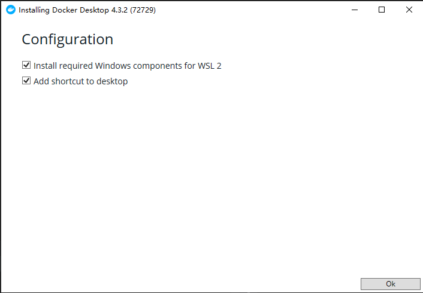

- [Download Docker](https://desktop.docker.com/win/main/amd64/Docker%20Desktop%20Installer.exe)
docker 下载地址，点击OK即可，稍等完成下载。

- Enable the WSL 2 feature on Windows

最近工作中接触了docker，开始试着敲了一些docker指令。

`docker images`：列出docker镜像

`docker ps`: 列出当前正在运行的docker容器

`docker cp .../ .../ `：从宿主机或docker容器中拷贝文件到docker容器或宿主机当中

`docker start containerId` ：启动docker容器

`docker attach containerId`：进入docker容器

我想这相当于最基本的查看操作，同时借鉴面向对象中类和实例的关系，对docker的理解停留在抽象层。想钻研其背景，多看总是很好的途径。

卷一

###### docker 与 虚拟机 

`Docker is just cgroups and namespace wrappedd up.` 这句话虽然对docker的描述已经深入到系统中的用户组和命名空间，但很难有直观的感受。