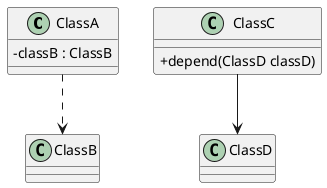

### Class Diagram
#### association and dependency

```puml
@startuml
skinparam classAttributeIconSize 0
class ClassA{

- classB : ClassB
}
ClassA ..> ClassB

class ClassC{

+ depend(ClassD classD)
}
ClassC --> ClassD
@enduml

```
以上两种关系代表关联和依赖，其中关联的耦合度强于依赖。在类的层次结构表达上，关联体现在ClassA含有成员变量ClassB，而依赖体现在ClassC中的方法需要ClassD作为参数传入。

